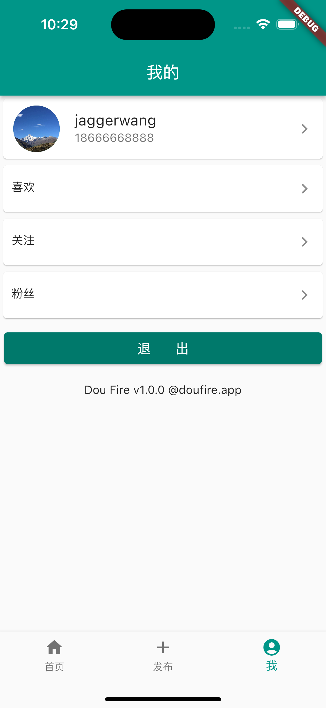

# dou_fire

抖火🔥

## 环境

Flutter: 3.3.3 

Dart: 2.18

## 效果





## android构建问题
```
 Could not download kotlin-compiler-embeddable.jar
```
修改Maven镜像地址，在文件
**Mac系统默认下载到：/Users/(用户名)/.gradle**

**Windows系统默认下载到：C:\Users\(用户名)\.gradle**

目录下创建init.gradle文件，代码内容如下：
```
allprojects{
    repositories {
        def ALIYUN_REPOSITORY_URL = 'https://maven.aliyun.com/repository/central/'
        def ALIYUN_JCENTER_URL = 'https://maven.aliyun.com/repository/public/'
        all { ArtifactRepository repo ->
            if(repo instanceof MavenArtifactRepository){
                def url = repo.url.toString()
                if (url.startsWith('https://repo1.maven.org/maven2') || url.startsWith('http://repo1.maven.org/maven2')) {
                    project.logger.lifecycle "Repository ${repo.url} replaced by $ALIYUN_REPOSITORY_URL."
                    remove repo
                }
                if (url.startsWith('https://jcenter.bintray.com/') || url.startsWith('http://jcenter.bintray.com/')) {
                    project.logger.lifecycle "Repository ${repo.url} replaced by $ALIYUN_JCENTER_URL."
                    remove repo
                }
            }
        }
        maven {
            url ALIYUN_REPOSITORY_URL
            url ALIYUN_JCENTER_URL
			url 'https://maven.aliyun.com/repository/google/'
			url 'https://maven.aliyun.com/repository/gradle-plugin/'
        }
    }
 
 
    buildscript{
        repositories {
            def ALIYUN_REPOSITORY_URL = 'https://maven.aliyun.com/repository/central/'
            def ALIYUN_JCENTER_URL = 'https://maven.aliyun.com/repository/public/'
            all { ArtifactRepository repo ->
                if(repo instanceof MavenArtifactRepository){
                    def url = repo.url.toString()
                    if (url.startsWith('https://repo1.maven.org/maven2') || url.startsWith('http://repo1.maven.org/maven2')) {
                        project.logger.lifecycle "Repository ${repo.url} replaced by $ALIYUN_REPOSITORY_URL."
                        remove repo
                    }
                    if (url.startsWith('https://jcenter.bintray.com/') || url.startsWith('http://jcenter.bintray.com/')) {
                        project.logger.lifecycle "Repository ${repo.url} replaced by $ALIYUN_JCENTER_URL."
                        remove repo
                    }
                }
            }
            maven {
                url ALIYUN_REPOSITORY_URL
                url ALIYUN_JCENTER_URL
				url 'https://maven.aliyun.com/repository/google/'
				url 'https://maven.aliyun.com/repository/gradle-plugin/'
            }
        }
    }
}allprojects{
    repositories {
        def ALIYUN_REPOSITORY_URL = 'https://maven.aliyun.com/repository/central/'
        def ALIYUN_JCENTER_URL = 'https://maven.aliyun.com/repository/public/'
        all { ArtifactRepository repo ->
            if(repo instanceof MavenArtifactRepository){
                def url = repo.url.toString()
                if (url.startsWith('https://repo1.maven.org/maven2') || url.startsWith('http://repo1.maven.org/maven2')) {
                    project.logger.lifecycle "Repository ${repo.url} replaced by $ALIYUN_REPOSITORY_URL."
                    remove repo
                }
                if (url.startsWith('https://jcenter.bintray.com/') || url.startsWith('http://jcenter.bintray.com/')) {
                    project.logger.lifecycle "Repository ${repo.url} replaced by $ALIYUN_JCENTER_URL."
                    remove repo
                }
            }
        }
        maven {
            url ALIYUN_REPOSITORY_URL
            url ALIYUN_JCENTER_URL
			url 'https://maven.aliyun.com/repository/google/'
			url 'https://maven.aliyun.com/repository/gradle-plugin/'
        }
    }
 
 
    buildscript{
        repositories {
            def ALIYUN_REPOSITORY_URL = 'https://maven.aliyun.com/repository/central/'
            def ALIYUN_JCENTER_URL = 'https://maven.aliyun.com/repository/public/'
            all { ArtifactRepository repo ->
                if(repo instanceof MavenArtifactRepository){
                    def url = repo.url.toString()
                    if (url.startsWith('https://repo1.maven.org/maven2') || url.startsWith('http://repo1.maven.org/maven2')) {
                        project.logger.lifecycle "Repository ${repo.url} replaced by $ALIYUN_REPOSITORY_URL."
                        remove repo
                    }
                    if (url.startsWith('https://jcenter.bintray.com/') || url.startsWith('http://jcenter.bintray.com/')) {
                        project.logger.lifecycle "Repository ${repo.url} replaced by $ALIYUN_JCENTER_URL."
                        remove repo
                    }
                }
            }
            maven {
                url ALIYUN_REPOSITORY_URL
                url ALIYUN_JCENTER_URL
				url 'https://maven.aliyun.com/repository/google/'
				url 'https://maven.aliyun.com/repository/gradle-plugin/'
            }
        }
    }
}
```

## android报错
```
Error: ADB exited with exit code 1
Performing Streamed Install

adb: failed to install /Users/jion/Desktop/GitHub/dou_fire/build/app/outputs/flutter-apk/app.apk: Failure [INSTALL_FAILED_INSUFFICIENT_STORAGE]
Error launching application on sdk gphone64 x86 64.
```

* Open Android Studio
* Open Virtual Device Manager
* 找到模拟器并进行编辑（虚拟设备配置）
* Show Advanced Settings
    向下滚动并找到内部存储（对我来说，默认为800MB）
    设置emulator需要多少MB（我输入了3000MB，效果很好）


## andriod 打包
 
 1. 设置应用名称 android->app->src->AndriodManifest.xml 修改application标签下的android:lable 即为应用名称
 2. 配置网络等权限
 3. 设置应用id,android->app->build.gradle 更改defaultConfig下的applicationId字段
 4. 版本号和版本名称，flutter已配置好自动获取pubspec.yaml的配置中获取version字段
 5. 设置支持的最低版本，保持不变不需要修改
 6. 配置图标，使用`flutter_launcher_icons`插件生成即可
 7. 配置签名，创建keystore, 创建key.properties文件
  ```
  //创建keystore, 创建时输入的密码需要和key.properties中存储的密码一致
  genkey -v -keystore ~/keystore.jks -keyalg RSA -keysize 2048 -validity 10000 -alias key

  ```
  创建key.properties文件,保存密钥信息：
  ```
    storePassword=dou_fire
    keyPassword=dou_fire
    keyAlias=keystore
    storeFile=keystore.jks
  ```
 8. 修改android->app->build.gradle文件，配置release构建参数
 ```
    //引入keystore文件及配置
    def keystoreProperties = new Properties()
    def keystorePropertiesFile = rootProject.file('key.properties')
    if (keystorePropertiesFile.exists()) {
        keystoreProperties.load(new FileInputStream(keystorePropertiesFile))
    }
 ```

 在defaultConfig下配置如下：
 ```
    // 配置签名
    signingConfigs {
        release {
            keyAlias keystoreProperties['keyAlias']
            keyPassword keystoreProperties['keyPassword']
            storeFile keystoreProperties['storeFile']
            storePassword keystoreProperties['storePassword']
        }
    }
 ```
 9. 项目根目录下执行
	```
	flutter build apk
 	```
